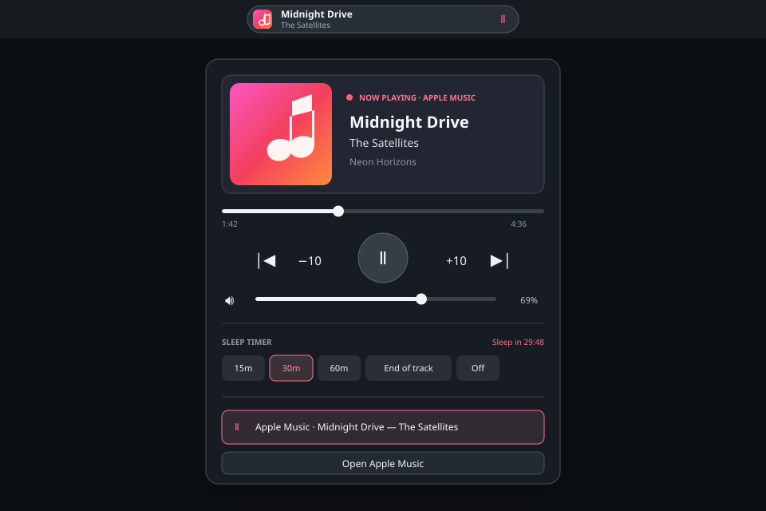

# Omarchy Apple Music Player

An Apple-first media experience for Omarchy built around Apple's official web player and the desktop's existing MPRIS service. No paid Apple Developer account, developer token, or stored Apple credentials are required.



## Features

- Launches or focuses the existing [Apple Music web player](https://music.apple.com/) window
- Rich Omarchy bar popup with album artwork, metadata, timeline, seeking, volume, mute, and playback controls
- Previous, −10 seconds, play/pause, +10 seconds, and next controls
- Apple-first source detection while keeping every MPRIS player selectable
- Capability-aware shuffle and repeat controls that only appear when supported
- Session-only sleep timer for 15, 30, or 60 minutes, or the end of the current track
- Keyboard navigation and existing hardware media-key support
- Update-safe user configuration with idempotent install, migration, and uninstall

## Requirements

- Omarchy with Hyprland and `omarchy-shell`
- Chromium or another browser supported by `omarchy launch ... webapp`
- `jq` and a working Widevine CDM
- An active Apple Music subscription

Bun is optional and is only used to run the development test suite.

The installed icon is local project artwork inspired by Apple Music's color palette; it is not an Apple-published trademark asset.

## Install or upgrade

```bash
git clone https://github.com/thebenwalther/omarchy-applemusicplayer.git ~/Work/github.com/thebenwalther/omarchy-applemusicplayer
cd ~/Work/github.com/thebenwalther/omarchy-applemusicplayer
bash scripts/install.sh
```

The installer:

- places `bmw.media` immediately before `omarchy.clock` in the center bar section;
- binds `SUPER + SHIFT + M` to Apple Music;
- removes the obsolete MusicKit service, mini-player binding, and control links during an upgrade;
- stores configuration and replaced-plugin backups under `$XDG_STATE_HOME/omarchy-applemusicplayer/backups` (normally `~/.local/state/...`);
- preserves the old MusicKit credential directory if it exists.

## Controls

| Surface | Action |
| --- | --- |
| `SUPER + SHIFT + M` | Launch or focus Apple Music |
| Any click on the bar widget | Open or close the detailed popup |
| Scroll on the widget | Adjust volume, or previous/next when volume is unavailable |
| `Space` in popup | Play/pause |
| `Left` / `Right` in popup | Seek −10 / +10 seconds |
| `Up` / `Down` in popup | Adjust volume by 5% |
| `Escape` | Close the popup |
| Hardware media keys | Previous, play/pause, and next through MPRIS |

Apple Music is selected automatically when its correlated Chromium MPRIS source is playing. Selecting another playing source manually keeps it active until it stops or disappears.

Sleep timers live only for the current shell session. “End of track” is best-effort: it pauses near the reported duration or when MPRIS reports that the track changed.

## Limitations

Chromium currently exposes Apple Music playback metadata and controls but not the optional [MPRIS TrackList interface](https://specifications.freedesktop.org/mpris/latest/Track_List_Interface.html). Consequently the widget cannot show Up Next. It also cannot provide Apple-specific lyrics, favorites, or library actions without relying on private page scraping or Apple APIs.

Shuffle and repeat remain hidden when the browser does not expose those optional MPRIS properties. Offline downloads, guaranteed lossless playback, and Dolby Atmos are not provided by this integration.

The earlier custom MusicKit implementation remains available at the annotated [`musickit-prototype-v0.1`](../../tree/musickit-prototype-v0.1) tag. Reviving it requires Apple Developer Program resources and signed [developer tokens](https://developer.apple.com/documentation/applemusicapi/generating-developer-tokens).

## Development

```bash
bun test
bash -n bin/omarchy-music scripts/install.sh scripts/uninstall.sh
jq empty integration/omarchy-plugin/manifest.json package.json
```

Tests exercise source selection, PID correlation, timer behavior, launcher matching, clean installation, upgrade migration, idempotency, and uninstall in isolated XDG fixtures.

## Uninstall

```bash
bash scripts/uninstall.sh
```

Uninstall removes the active plugin, launcher, binding, desktop entry, and bar-layout item. It keeps credentials and all backups for manual recovery.
