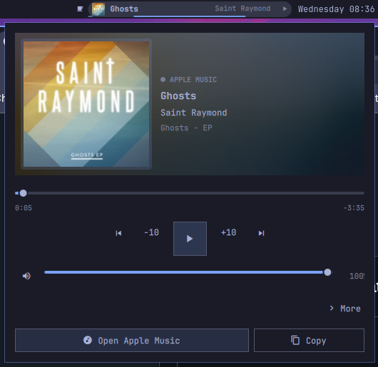
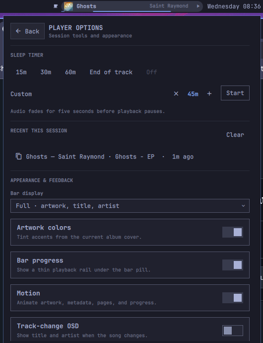

# Omarchy Apple Music Player

[](https://github.com/thebenwalther/omarchy-applemusicplayer/actions/workflows/ci.yml)
[](https://github.com/thebenwalther/omarchy-applemusicplayer/releases/latest)
[](LICENSE)

An Apple-first media experience for Omarchy built around Apple's official web player and the desktop's existing MPRIS service. No paid Apple Developer account, developer token, or stored Apple credentials are required.





## Features

- Launches or focuses the existing [Apple Music web player](https://music.apple.com/) window
- Cinematic, responsive two-page popup with large artwork, an artwork-derived accent, ambient depth, and readable Omarchy-native colors
- Stable bar pill with Full, Title, and Compact layouts plus an optional progress rail
- Timeline, seeking, volume, mute, previous/next, and capability-aware playback controls
- Keyboard-first navigation with visible focus states and automatic scrolling
- Apple-first source detection while keeping every MPRIS player selectable
- Capability-aware shuffle and repeat controls that only appear when supported
- Session-only sleep timer for presets, a custom 5–180 minute duration, or the end of the current track, with a five-second volume fade
- Copy Now Playing, optional track-change OSD, and a private in-memory history of the ten most recent unique tracks
- Relative history timestamps and one-click handoff to Omarchy's native Audio Output panel
- Persistent appearance and feedback preferences, including a motion-reduction toggle
- Keyboard navigation and existing hardware media-key support
- Update-safe user configuration with idempotent install, migration, and uninstall

## Requirements

- Omarchy 4.0.1 or newer with Hyprland and `omarchy-shell`
- Chromium or another browser supported by `omarchy launch ... webapp`
- `jq` and a working Widevine CDM
- An active Apple Music subscription

Bun is optional and is only used to run the development test suite.

This is an independent community project and is not affiliated with, endorsed by, or sponsored by Apple Inc. Apple Music is a trademark of Apple Inc. The installed icon is local project artwork inspired by Apple Music's color palette; it is not an Apple-published trademark asset.

## Install or upgrade

```bash
git clone https://github.com/thebenwalther/omarchy-applemusicplayer.git ~/Work/github.com/thebenwalther/omarchy-applemusicplayer
cd ~/Work/github.com/thebenwalther/omarchy-applemusicplayer
bash scripts/install.sh
```

The installer:

- places `bmw.media` immediately before `omarchy.clock` in the center bar section;
- preserves existing `bmw.media` inline preferences across installs and upgrades;
- binds `SUPER + SHIFT + M` to Apple Music;
- removes the obsolete MusicKit service, mini-player binding, and control links during an upgrade;
- stores configuration and replaced-plugin backups under `$XDG_STATE_HOME/omarchy-applemusicplayer/backups` (normally `~/.local/state/...`);
- preserves the old MusicKit credential directory if it exists.

## Controls

| Surface | Action |
| --- | --- |
| `SUPER + SHIFT + M` | Launch or focus Apple Music |
| Any click on the bar widget | Open or close the detailed popup |
| Scroll on the widget | Adjust volume, or previous/next when volume is unavailable |
| `Space` in popup | Play/pause |
| `Left` / `Right` in popup | Seek −10 / +10 seconds |
| `Up` / `Down` in popup | Adjust volume by 5% |
| `Tab` / `Shift + Tab` | Move between popup controls |
| `Escape` | Return to Player from More, then close the popup |
| Hardware media keys | Previous, play/pause, and next through MPRIS |

Apple Music is selected automatically when its correlated Chromium MPRIS source is playing. Selecting another playing source manually keeps it active until it stops or disappears.

Open **More** for sleep presets and a custom duration, the latest five entries from session history, appearance preferences, and Omarchy's native Audio Output panel. Opening the popup always returns to the Player page. The history keeps at most ten unique tracks in memory and is cleared when the shell restarts; entries can be copied but cannot be replayed because Apple exposes no stable track URL through MPRIS.

Sleep timers live only for the current shell session. During the final five seconds the widget fades the selected source when volume is supported, pauses it, restores its original volume while paused, and shows an Omarchy OSD. Cancelling during the fade restores the volume immediately. “End of track” is best-effort: it uses the reported position, duration, and track identity.

## Preferences

The following settings are stored inline with the `bmw.media` entry in `~/.config/omarchy/shell.json` and can be changed from **More**:

| Setting | Default | Effect |
| --- | --- | --- |
| `barDisplayMode` | `"full"` | Chooses Full, Title, or Compact bar content; vertical bars are always compact |
| `dynamicArtworkColor` | `true` | Uses a contrasting, vivid artwork color for accents and glow |
| `barProgress` | `true` | Shows progress along the bottom of the bar pill |
| `motionEnabled` | `true` | Enables the 220ms artwork and metadata transition |
| `trackChangeOsd` | `false` | Shows `Title — Artist` when a track changes |
| `rememberSessionHistory` | `true` | Keeps up to ten tracks until the shell restarts |

Text always uses the Omarchy popup palette; artwork colors are limited to accents, progress, borders, and glow. `wl-copy` is optional, and copy actions are disabled when it is unavailable.

## Limitations

Chromium currently exposes Apple Music playback metadata and controls but not the optional [MPRIS TrackList interface](https://specifications.freedesktop.org/mpris/latest/Track_List_Interface.html). Consequently the widget cannot show Up Next. It also cannot provide Apple-specific lyrics, favorites, or library actions without relying on private page scraping or Apple APIs.

Shuffle and repeat remain hidden when the browser does not expose those optional MPRIS properties. Offline downloads, guaranteed lossless playback, and Dolby Atmos are not provided by this integration.

The pre-cinematic web/MPRIS release is recoverable at the annotated [`v3.0.0`](https://github.com/thebenwalther/omarchy-applemusicplayer/tree/v3.0.0) tag. The earlier custom MusicKit experiment is archived at [`musickit-prototype-v0.1`](https://github.com/thebenwalther/omarchy-applemusicplayer/tree/musickit-prototype-v0.1); it is unsupported, is not part of the current installation, and contains no real Apple credentials. Reviving MusicKit requires Apple Developer Program resources and signed [developer tokens](https://developer.apple.com/documentation/applemusicapi/generating-developer-tokens).

## Development

```bash
bun test
bash -n bin/omarchy-music scripts/install.sh scripts/uninstall.sh
jq empty integration/omarchy-plugin/manifest.json package.json
```

Tests exercise source selection, PID correlation, palette ownership and fallback, bar-mode normalization, responsive thresholds, relative timestamps, custom timer bounds, every sleep-fade transition, launcher matching, clean installation, preference-preserving upgrades, idempotency, and uninstall in isolated XDG fixtures.

See [CONTRIBUTING.md](CONTRIBUTING.md) before proposing changes. Please use GitHub's private vulnerability reporting flow described in [SECURITY.md](SECURITY.md) for security-sensitive reports.

## Uninstall

```bash
bash scripts/uninstall.sh
```

Uninstall removes the active plugin, launcher, binding, desktop entry, and bar-layout item. It keeps credentials and all backups for manual recovery.
